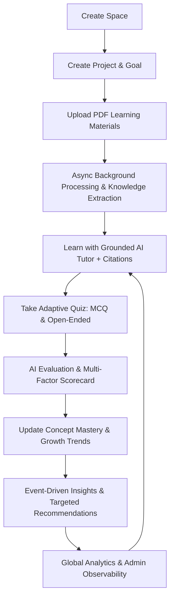

# 🧠 AI Study Companion — AI-Powered Learning & Growth Workspace

> **A persistent, contextual, and measurable AI learning companion designed to help users understand, practice, measure, and continuously improve their knowledge.**

---

## 🌟 Core Architecture & The Learning Loop

The product answers three fundamental learning questions in real-time:
1. **What am I learning?** (Spaces, Projects, Goals, Uploaded PDFs, Extracted Knowledge & Concepts)
2. **How well am I learning it?** (Adaptive Quizzes, Open-Ended AI Assessments, Mistake Tracking, Dynamic Concept Mastery)
3. **What should I do next?** (Growth Analysis, Weakness Detection, Targeted Next-Action Recommendations)



---

## 🚀 Key Features

### 1. 📂 Strict Hierarchy & Data Isolation
- **User $\rightarrow$ Space $\rightarrow$ Project**: Clean multi-space organization.
- Every database query and semantic vector search is strictly scoped to `project_id` and `user_id` to guarantee zero data leakage between distinct learning journeys.

### 2. 📑 Asynchronous Document Processing Pipeline
- **Pipeline**: `Upload` $\rightarrow$ `Queued` $\rightarrow$ `PDF Text & Structure Extraction` $\rightarrow$ `Semantic Chunking` $\rightarrow$ `Vector Embeddings` $\rightarrow$ `AI Concept Extraction` $\rightarrow$ `Ready`.
- Stores page-level source mappings so every chunk, concept, and answer traces directly back to its exact document and page number.

### 3. 💬 Grounded AI Tutor with Verified Citations & Refusal Guardrail
- Context composed of: Project Goal + Retrieved Document Chunks (Top-K) + Concept Mastery + Learner Strengths/Weaknesses + Conversation History.
- **Strict Evidence Guardrail**: Answers grounded questions with verified citation pills (`Source: [Doc Name] — Page X`).
- **Anti-Hallucination Refusal**: If a question is out-of-domain or lacks evidence in the uploaded documents, the tutor explicitly refuses to invent facts and suggests relevant indexed project concepts.
- Real-time Server-Sent Events (SSE) streaming.

### 4. ✍️ Adaptive Quiz & Multi-Factor AI Evaluation
- Considers concept mastery, recent mistakes, and difficulty (not naive wrong/easy logic).
- **Multiple-Choice Questions**: Instant verification with detailed rationale for every option.
- **Open-Ended Conceptual Questions**: AI Evaluator scores:
  - **Understanding Score** ($0-100\%$)
  - **Technical Accuracy** ($0-100\%$)
  - **Key Concepts Covered** (checklist)
  - **Missing / Weak Nuances** (actionable points)
  - **Encouraging Coaching Feedback**
- Victory celebration with interactive confetti!

### 5. 📈 Dynamic Concept Mastery & Growth Engine
- Tracks concept-level mastery scores ($0-100\%$) updated via exponential smoothing ($60\%$ historical + $40\%$ recent performance).
- Categorizes concepts into:
  - 🟢 **Improving** (Mastery $\ge 75\%$ and climbing)
  - 🟡 **Stable** (Mastery $50-74\%$)
  - 🔴 **Requiring Attention** (Mastery $<50\%$ or recent mistakes)

### 6. 🔮 Event-Driven Targeted Recommendations ("What should I do next?")
- Automatically generates prioritized action cards (e.g. *"Review L2 Regularization penalty mechanics and complete a 2-question focused drill"*).

### 7. 📊 AI Observability & Admin Console
- Platform-level KPIs (Total AI requests, Total Tokens, Avg Latency, Estimated Cost, Success Rate).
- AI Consumption Breakdown by feature (`tutor_chat`, `quiz_generation`, `quiz_grading`, `concept_extraction`, `recommendation`).
- Live Request Stream & Trace Inspector (Prompt & Response inspection).
- Background Queue Task Monitor.
- Automated AI Regression Test Runner testing Groundedness, Refusal, Grading Quality, and Recommendations.

---

## 🛠️ Technology Stack

| Layer | Technology |
| :--- | :--- |
| **Frontend** | React 18, TypeScript, Vite, Tailwind & CSS Tokens, Lucide Icons, Canvas Confetti |
| **Backend** | Node.js v24, Express, TypeScript, `tsx` runtime |
| **Database** | Native SQLite (`node:sqlite` DatabaseSync with WAL mode & Foreign Keys) |
| **Vector Engine** | High-dimensional Cosine Similarity Vector Index with Project Isolation |
| **Document Processing**| `pdf-parse` & Semantic Chunker with Page Number Indexing |
| **AI Providers** | Google Gemini API (`@google/genai`), OpenAI API, plus Built-in High-Fidelity Local Simulation Engine |

---

## ⚡ Quick Start Instructions

### 1. Start the Application

Open two terminal tabs:

**Tab 1 — Start Backend Server (Port 3001):**
```bash
cd server
npm run dev
```

**Tab 2 — Start Frontend Client (Port 5173):**
```bash
cd client
npm run dev
```

Open your browser and navigate to:
👉 **`http://localhost:5173/`**

---

## 🧪 Running Automated AI Evaluations

To run the automated AI evaluation suite directly from the terminal:
```bash
cd server
npm run eval
```
Or click **"Run Automated AI Evals"** inside the in-app Admin & Observability Dashboard.

---

## 📜 Development & Engineering Decisions

1. **Native SQLite (`node:sqlite`)**: Leveraging Node.js 24's native SQLite engine eliminates native C++ node-gyp compilation issues on Windows while delivering synchronous microsecond query speeds.
2. **Hybrid Grounding Guardrail**: Computes vector cosine similarity and keyword overlap before sending requests to the LLM. If confidence is below the grounding threshold for out-of-domain questions, the system triggers refusal guardrails to prevent hallucinations.
3. **Dual Provider & Simulation Fallback**: The app connects seamlessly to real Gemini / OpenAI keys, while also providing a built-in simulation engine so evaluation suites and UI flows run reliably even offline.
