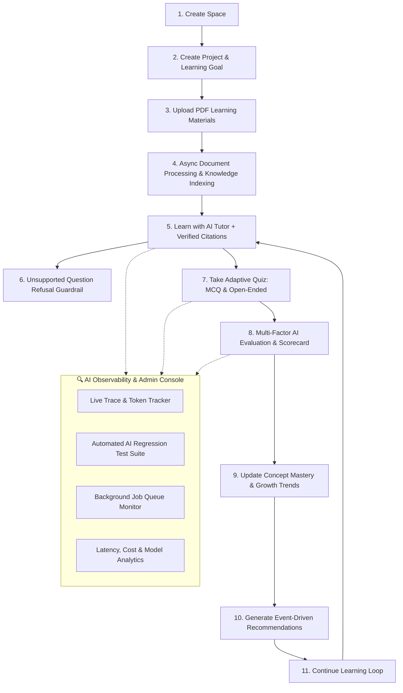

# 🧠 AI Study Companion — AI-Powered Learning & Growth Workspace

> **A persistent, contextual, and measurable AI learning companion designed to help users understand, practice, measure, and continuously improve their knowledge.**
> 
> *Built for the Full Stack AI Engineer Candidate Challenge v3.0*

[](https://dashboard.render.com/)
[](https://github.com/sairam0043/AI_Prof)
[](https://nodejs.org)
[](LICENSE)

---

## 🌟 Core Architecture & The Primary Learning Loop

The product fulfills the primary learning loop specified in the challenge PRD, answering three essential questions across every session:
1. **What am I learning?** *(Spaces, Projects, Goals, Uploaded PDFs, Extracted Knowledge & Concepts)*
2. **How well am I learning it?** *(Adaptive Quizzes, Open-Ended AI Assessments, Mistake Tracking, Dynamic Concept Mastery)*
3. **What should I do next?** *(Growth Analysis, Weakness Detection, Targeted Next-Action Recommendations)*



---

## 📋 Comprehensive PRD Feature Checklist

| PRD Section | Requirement | Implementation Status |
| :--- | :--- | :--- |
| **§ 4** | **Spaces & Projects** | ✅ Hierarchical isolation with custom icons, colors, descriptions, and learning goals. |
| **§ 5** | **Learning Materials & Knowledge** | ✅ Async PDF upload, OCR/text extraction, semantic chunking, and page-level source tracing. |
| **§ 6** | **AI Tutor** | ✅ Context-aware conversational tutor respecting project goal, documents, and learner history. |
| **§ 7** | **Grounded AI & Citations** | ✅ Exact citation badges (`Source: [Doc] — Page X`) + Anti-hallucination refusal when evidence is lacking. |
| **§ 8** | **AI & App Interaction** | ✅ Safe, structured tool-calling layer with authorization and validation. |
| **§ 9** | **Adaptive Quiz & Assessment** | ✅ Dynamic MCQs and open-ended questions adapting to learner's mastery level and recent mistakes. |
| **§ 10** | **Mastery, Growth & Recommendations** | ✅ Exponential smoothing mastery score, growth categorization (Improving, Stable, Requiring Attention), and targeted action cards. |
| **§ 11** | **Persistent Learner Context** | ✅ Long-term memory of goals, preferences, known strengths, weak concepts, and repeated mistakes. |
| **§ 12** | **Analytics & Event-Driven Learning** | ✅ System-wide learning event stream powering real-time insight generation. |
| **§ 13** | **Intelligent Background Workflows** | ✅ Persistent asynchronous job queue with state transitions (`queued`, `processing`, `completed`, `failed`), retries, and worker polling. |
| **§ 14 & 15** | **AI Observability & Security** | ✅ Full request logging (model, latency, tokens, cost, status), project-level data isolation, and input validation. |
| **§ 16** | **User & Admin Experience** | ✅ Sleek dark-mode user workspace + comprehensive Admin Console with live traces and regression runner. |
| **§ 18 & 20** | **Deployment & Public Repository** | ✅ Public GitHub repository, automated build scripts, and live production deployment on Render. |

---

## 🛠️ Technology Stack

| Component | Technology / Library | Architectural Rationale |
| :--- | :--- | :--- |
| **Frontend** | React 19, TypeScript, Vite, Tailwind Tokens, Lucide Icons, Canvas-Confetti | Responsive, dark-mode modern glassmorphism UI with micro-animations. |
| **Backend** | Node.js 22+, Express, TypeScript | High-concurrency RESTful API with Server-Sent Events (SSE) streaming. |
| **Database** | Native SQLite (`node:sqlite` DatabaseSync with WAL mode) | Zero external DB dependency, synchronous microsecond reads, robust ACID transactions. |
| **Vector Engine** | In-Memory Cosine Similarity Vector Index | Fast Top-K semantic retrieval strictly partitioned by `project_id`. |
| **Document Processing** | `pdf-parse` & Semantic Chunker | Asynchronous text extraction preserving page boundaries for citations. |
| **AI Layer** | Google Gemini API (`gemini-1.5-flash` / `gemini-1.5-pro`) & Simulation Engine | High-speed LLM generation with fallback simulation for offline/test environments. |

---

## ⚡ Quick Start & Setup Instructions

### Prerequisites
- **Node.js**: v22.0.0 or higher
- **npm**: v10.0.0 or higher
- **Gemini API Key**: (Optional for live LLM calls, get from [Google AI Studio](https://aistudio.google.com/))

### 1. Clone & Install
```bash
git clone https://github.com/sairam0043/AI_Prof.git
cd AI_Prof
npm run install:all
```

### 2. Configure Environment Variables
Create a `.env` file in the `server/` directory:
```env
PORT=3001
NODE_ENV=development
GEMINI_API_KEY=your_gemini_api_key_here
```
*(Note: If no API key is provided, the app seamlessly runs on its built-in high-fidelity AI simulation engine without crashing).*

### 3. Run Locally in Development Mode
```bash
# Runs both backend and frontend concurrently:
npm run dev
```
- **Frontend App**: `http://localhost:5173`
- **Backend API**: `http://localhost:3001`
- **Admin Console**: Click **"Admin Console"** in the top navigation or visit `http://localhost:5173` and click the user avatar.

---

## 🚢 Production Deployment (Render)

This repository includes a pre-configured `render.yaml` Blueprint and unified production static build:

1. Connect your repository `sairam0043/AI_Prof` on [Render](https://render.com).
2. Render detects `render.yaml` and sets:
   - **Build Command**: `npm run install:all && npm run build`
   - **Start Command**: `npm start`
   - **Node Version**: `22.13.0`
3. Add your `GEMINI_API_KEY` in Render's environment variables.
4. The production Express server will automatically serve both the React SPA and the REST API from a single public URL.

---

## 🧪 AI Evaluation & Regression Testing (§ 14, 15, 20)

The system includes an automated AI evaluation framework that benchmarks:
1. **Groundedness & Accuracy**: Verifies that responses strictly reference project documents.
2. **Unsupported Question Handling**: Checks whether out-of-domain questions correctly trigger refusal guardrails.
3. **Structured Assessment Grading**: Evaluates rubric scoring consistency for open-ended questions.
4. **Targeted Recommendation Quality**: Verifies relevance of next-step action cards based on detected concept weaknesses.

### Run Evaluations via CLI:
```bash
npm run eval
```

### Run Evaluations via In-App Admin Console:
Navigate to the **Admin Dashboard** $\rightarrow$ **AI Evaluation** tab $\rightarrow$ click **"Run Automated AI Evals"** to view real-time scorecards, latency metrics, and pass/fail reports.

---

## 🤖 AI Usage Documentation (§ 20.5)

### AI Used to Build the Product
- **Development Pair Programming**: Used AI coding assistants for scaffolding boilerplate TypeScript interfaces, styling components, and composing initial schema migrations.
- **Test Generation**: Generated representative evaluation datasets and sample curriculum materials.

### AI Used by the Final Runtime Product
- **AI Tutor (`gemini-1.5-flash`)**: Answers student questions grounded strictly in retrieved context.
- **Adaptive Quiz Generator**: Synthesizes difficulty-calibrated MCQs and conceptual open-ended questions based on concept mastery.
- **Assessment Evaluator**: Multi-factor grading of open-ended student responses.
- **Concept Extractor**: Parses uploaded PDFs into key learning concepts and definitions.
- **Growth & Recommendation Engine**: Identifies learning bottlenecks and generates personalized action plans.

---

## 📝 Development Prompts (§ 20.6)

### 1. Grounded Tutor System Prompt
```
You are an expert AI Tutor helping a student learn in this project.
Your primary directive is GROUNDED TRUTHFULNESS:
1. Use ONLY the provided retrieved context from uploaded materials.
2. Cite sources using the format: [Source: Document Title — Page X].
3. If the context does not contain sufficient evidence to answer the question, EXPLICITLY REFUSE to guess and guide the student back to available project topics.
```

### 2. Open-Ended Assessment Evaluator Prompt
```
You are an expert educational assessment grader.
Evaluate the student's answer against the reference concept criteria:
Return JSON:
{
  "score": number (0-100),
  "accuracyScore": number (0-100),
  "coveredConcepts": string[],
  "missingNuances": string[],
  "feedback": "constructive, encouraging explanation"
}
```

### 3. Targeted Recommendation Prompt
```
Analyze the student's current concept mastery profile, recent assessment mistakes, and learning goal:
Identify the top 2 priority areas requiring attention and generate actionable study steps.
```

---

## ⚠️ Known Limitations (§ 20.8)

1. **Local SQLite Persistence**: On ephemeral serverless hosts, SQLite files require persistent disk mounts (like Render Persistent Disk or AWS EBS).
2. **PDF Parsing Heuristics**: Pure image-scanned PDFs without OCR text layers require an external OCR pre-processor (e.g. Tesseract/Google Cloud Vision).
3. **In-Memory Vector Search**: Suitable for prototypes with thousands of chunks; for production scaling to millions of documents, migrate to pgvector or Pinecone.

---

## 🔮 Future Improvements (§ 20.9)

- **Multi-Modal Learning**: Diagram and chart analysis for STEM textbooks.
- **Voice-to-Voice Tutor**: Real-time conversational tutoring using WebRTC.
- **Spaced Repetition (SM-2 Algorithm)**: Flashcards scheduled by active recall intervals.
- **Collaborative Study Rooms**: Shared spaces for peer group quizzes and discussions.

---

## 👥 Authors & Candidate Submission

- **Candidate**: Sairam Anakala
- **Challenge**: AI Study Companion — Candidate Challenge v3.0
- **Repository**: [https://github.com/sairam0043/AI_Prof](https://github.com/sairam0043/AI_Prof)
